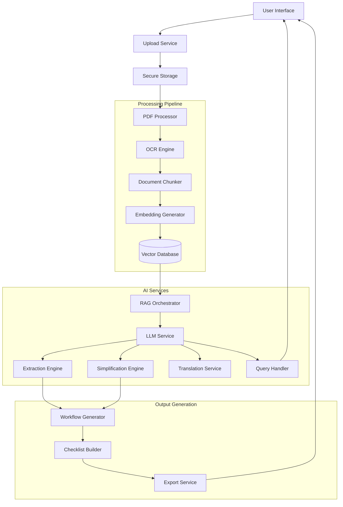

# Design Document: Bureaucracy Whisperer

## Overview

The Bureaucracy Whisperer is an AI-powered document processing system that transforms complex government and legal PDFs into actionable workflows. The system leverages Large Language Models (LLMs) with Retrieval-Augmented Generation (RAG) to provide semantic understanding of unstructured documents, extract structured information, simplify legal language, and enable interactive question-answering.

### Real-World Deployment Scenario

The system is designed for deployment in high-friction bureaucratic environments where citizens struggle with document interpretation.

**Initial deployment contexts include:**
- Government permit applications (building, trade, licenses)
- Public welfare scheme eligibility documents
- Legal compliance forms for small businesses
- Immigration and visa documentation

**Primary users:**
- Citizens with low legal literacy
- Small business owners
- Rural and multilingual populations
- NGOs assisting with government access

**Expected outcomes:**
- Reduction in application rejection rates
- Faster completion of bureaucratic tasks
- Reduced dependence on intermediaries/agents
- Increased access to public services

### Why AI Is Required (Not Rule-Based Automation)

Government and legal documents vary significantly across:
- format
- language
- structure
- terminology
- implicit requirements

**Traditional rule-based systems fail because:**
- deadlines are described contextually, not in fixed fields
- requirements depend on interpretation of clauses
- steps are scattered across pages
- conditions are implied rather than explicitly structured

**The Bureaucracy Whisperer uses:**
- semantic reasoning to interpret intent
- contextual extraction instead of keyword matching
- cross-document understanding
- inference of dependencies between tasks

This makes AI essential rather than optional.

### Deployment & Scalability Plan

The system is designed for phased deployment:

**Phase 1 — Hackathon MVP**
- PDF → workflow generation
- Checklist
- Q&A

**Phase 2 — Pilot**
- Integration with civic tech platforms
- NGO partnerships
- Mobile-first interface

**Phase 3 — National Scale**
- Government API integrations
- multilingual support across regional languages
- automated scheme discovery

**Infrastructure scalability:**
- stateless microservices
- vector DB scaling horizontally
- GPU inference for batch document processing

### Impact Measurement Framework

The system will track:
- reduction in application errors
- workflow completion rates
- time saved per process
- user comprehension scores
- multilingual usage rates

This ensures measurable public impact rather than theoretical AI capability.

### Key Design Principles

1. **AI-First Architecture**: Use LLMs for semantic understanding rather than rule-based parsing
2. **Traceability**: Every AI-generated output must be traceable to source document segments
3. **Confidence-Aware**: All extractions include confidence scores to enable user verification
4. **Modular Pipeline**: Separate concerns (extraction, simplification, translation, Q&A) for maintainability
5. **Security by Design**: Encrypt data at rest and in transit, support data deletion

### AI Reasoning Pipeline

The system follows a multi-stage reasoning pipeline to convert unstructured documents into executable workflows:

**Document grounding**
- PDF parsing and OCR
- Semantic chunking
- Embedding generation

**Context retrieval (RAG)**
- Query-specific chunk retrieval
- Relevance scoring
- Context window construction

**LLM reasoning layer**
- Structured extraction of tasks, deadlines, and requirements
- Legal language simplification
- Dependency inference between steps

**Verification layer**
- Confidence scoring
- Cross-chunk validation
- Citation traceability

**Execution layer**
- Workflow generation
- Checklist creation
- Interactive guidance

This pipeline ensures the system moves from document interpretation → decision support → execution guidance, rather than simple summarization.

## Architecture

### High-Level System Architecture



### Component Interaction Flow

1. **Upload Phase**: User uploads PDF → Validation → Secure storage
2. **Processing Phase**: PDF extraction → OCR (if needed) → Chunking → Embedding → Vector storage
3. **Extraction Phase**: RAG retrieval → LLM extraction → Confidence scoring → Structured output
4. **Simplification Phase**: Legal text → LLM simplification → Explanation traces
5. **Workflow Generation**: Extracted data → Sequential ordering → Dependency analysis → Workflow
6. **Interactive Phase**: User questions → RAG retrieval → LLM reasoning → Citation-based answers

## Components and Interfaces

### 1. Upload Service

**Responsibility**: Handle PDF uploads, validation, and secure storage

**Interface**:
```typescript
interface UploadService {
  uploadDocument(file: File, userId: string): Promise<UploadResult>
  validatePDF(file: File): ValidationResult
  storeSecurely(file: File, metadata: DocumentMetadata): Promise<string>
}

interface UploadResult {
  documentId: string
  status: 'success' | 'error'
  message: string
  processingStarted: boolean
}

interface ValidationResult {
  isValid: boolean
  fileSize: number
  errors: string[]
}
```

**Implementation Notes**:
- Maximum file size: 50MB
- Validate PDF magic bytes (25 50 44 46)
- Generate unique document ID (UUID v4)
- Encrypt file with AES-256 before storage
- Use TLS 1.3 for transmission

### 2. PDF Processor

**Responsibility**: Extract text and structure from PDFs, handle OCR for scanned documents

**Interface**:
```typescript
interface PDFProcessor {
  extractText(documentId: string): Promise<ExtractedContent>
  detectScannedPDF(documentId: string): Promise<boolean>
  performOCR(documentId: string): Promise<OCRResult>
}

interface ExtractedContent {
  text: string
  pages: PageContent[]
  metadata: PDFMetadata
  isScanned: boolean
  quality: 'high' | 'medium' | 'low'
}

interface PageContent {
  pageNumber: number
  text: string
  boundingBoxes: TextRegion[]
}

interface OCRResult {
  text: string
  confidence: number
  warnings: string[]
}
```

**Implementation Notes**:
- Use pdf.js or PyPDF2 for text extraction
- Use Tesseract OCR for scanned documents
- Detect scanned PDFs by checking text-to-image ratio
- Preserve page numbers and bounding boxes for citation

### 3. Document Chunker

**Responsibility**: Split documents into semantic chunks for embedding and retrieval

**Interface**:
```typescript
interface DocumentChunker {
  chunkDocument(content: ExtractedContent): Promise<DocumentChunk[]>
  identifySemanticBoundaries(text: string): number[]
}

interface DocumentChunk {
  chunkId: string
  documentId: string
  text: string
  pageNumbers: number[]
  startOffset: number
  endOffset: number
  metadata: ChunkMetadata
}

interface ChunkMetadata {
  sectionType: 'header' | 'body' | 'list' | 'table' | 'footer'
  semanticRole: string
}
```

**Implementation Notes**:
- Target chunk size: 500-1000 tokens
- Use sliding window with 100-token overlap
- Respect semantic boundaries (paragraphs, sections)
- Preserve document structure metadata

### 4. Embedding Generator & Vector Database

**Responsibility**: Generate embeddings for chunks and enable semantic search

**Interface**:
```typescript
interface EmbeddingGenerator {
  generateEmbedding(text: string): Promise<number[]>
  batchGenerateEmbeddings(texts: string[]): Promise<number[][]>
}

interface VectorDatabase {
  storeChunks(chunks: DocumentChunk[], embeddings: number[][]): Promise<void>
  semanticSearch(query: string, documentId: string, topK: number): Promise<SearchResult[]>
  deleteDocument(documentId: string): Promise<void>
}

interface SearchResult {
  chunk: DocumentChunk
  similarity: number
  rank: number
}
```

**Implementation Notes**:
- Use OpenAI text-embedding-3-small or similar (1536 dimensions)
- Vector DB: Pinecone, Weaviate, or Qdrant
- Index by documentId for efficient filtering
- Cosine similarity for search
- Return top-5 chunks by default

### 5. RAG Orchestrator

**Responsibility**: Coordinate retrieval and LLM generation with context

**Interface**:
```typescript
interface RAGOrchestrator {
  retrieveContext(query: string, documentId: string): Promise<RetrievedContext>
  generateWithContext(prompt: string, context: RetrievedContext): Promise<RAGResponse>
}

interface RetrievedContext {
  chunks: DocumentChunk[]
  relevanceScores: number[]
  totalTokens: number
}

interface RAGResponse {
  content: string
  citations: Citation[]
  confidence: number
  tokensUsed: number
}

interface Citation {
  chunkId: string
  pageNumbers: number[]
  text: string
  relevance: number
}
```

**Implementation Notes**:
- Retrieve top-5 most relevant chunks
- Construct prompt with retrieved context
- Include citation instructions in system prompt
- Parse LLM response for citation markers
- Calculate confidence from retrieval scores and LLM logprobs

### 6. Extraction Engine

**Responsibility**: Extract structured information (deadlines, fees, steps, documents) using LLM

**Interface**:
```typescript
interface ExtractionEngine {
  extractStructuredInfo(documentId: string): Promise<ExtractedInfo>
  extractDeadlines(context: RetrievedContext): Promise<Deadline[]>
  extractFees(context: RetrievedContext): Promise<Fee[]>
  extractRequiredDocuments(context: RetrievedContext): Promise<RequiredDocument[]>
  extractSteps(context: RetrievedContext): Promise<ProcessStep[]>
}

interface ExtractedInfo {
  deadlines: Deadline[]
  fees: Fee[]
  requiredDocuments: RequiredDocument[]
  steps: ProcessStep[]
  contacts: ContactInfo[]
  confidence: ConfidenceScores
}

interface Deadline {
  description: string
  date: string | null
  daysFromStart: number | null
  isAbsolute: boolean
  citations: Citation[]
  confidence: number
}

interface Fee {
  description: string
  amount: number | null
  currency: string
  isVariable: boolean
  citations: Citation[]
  confidence: number
}

interface RequiredDocument {
  name: string
  description: string
  isMandatory: boolean
  citations: Citation[]
  confidence: number
}

interface ProcessStep {
  stepNumber: number
  description: string
  dependencies: number[]
  estimatedDuration: string | null
  citations: Citation[]
  confidence: number
}

interface ConfidenceScores {
  overall: number
  deadlines: number
  fees: number
  documents: number
  steps: number
}
```

**Implementation Notes**:
- Use structured output mode (JSON schema) with LLM
- Perform multiple extraction passes for different entity types
- Use RAG to retrieve relevant context for each extraction type
- Prompt engineering: Include examples of good extractions
- Confidence scoring based on:
  - Retrieval relevance scores
  - LLM logprobs (if available)
  - Presence of explicit vs. implicit information
  - Cross-validation between multiple chunks
- Flag items with confidence < 0.7 for manual verification

### 7. Simplification Engine

**Responsibility**: Convert legal/bureaucratic language to plain language with traceability

**Interface**:
```typescript
interface SimplificationEngine {
  simplifyText(legalText: string, context: RetrievedContext): Promise<SimplifiedText>
  generateExplanationTrace(original: string, simplified: string): Promise<ExplanationTrace>
}

interface SimplifiedText {
  original: string
  simplified: string
  readingLevel: number
  preservedTerms: PreservedTerm[]
  explanationTrace: ExplanationTrace
  confidence: number
}

interface PreservedTerm {
  term: string
  definition: string
  reason: string
}

interface ExplanationTrace {
  steps: ExplanationStep[]
  sourceReferences: Citation[]
}

interface ExplanationStep {
  originalPhrase: string
  simplifiedPhrase: string
  reasoning: string
}
```

**Implementation Notes**:
- Use LLM with specific simplification prompt
- Target reading level: 8th grade (Flesch-Kincaid)
- Preserve critical legal terms with inline definitions
- Generate explanation traces showing transformation logic
- Validate that simplified text preserves all requirements
- Use RAG to ensure simplification doesn't lose context

### 8. Workflow Generator

**Responsibility**: Create sequential, actionable workflows from extracted information

**Interface**:
```typescript
interface WorkflowGenerator {
  generateWorkflow(extractedInfo: ExtractedInfo): Promise<Workflow>
  orderSteps(steps: ProcessStep[]): ProcessStep[]
  identifyDependencies(steps: ProcessStep[]): DependencyGraph
}

interface Workflow {
  title: string
  steps: WorkflowStep[]
  estimatedDuration: string
  criticalPath: number[]
  dependencies: DependencyGraph
}

interface WorkflowStep {
  stepNumber: number
  title: string
  description: string
  simplifiedDescription: string
  associatedDeadlines: Deadline[]
  associatedFees: Fee[]
  requiredDocuments: RequiredDocument[]
  dependencies: number[]
  isTimeSensitive: boolean
  citations: Citation[]
}

interface DependencyGraph {
  nodes: number[]
  edges: [number, number][]
}
```

**Implementation Notes**:
- Order steps chronologically based on deadlines and dependencies
- Use topological sort for dependency ordering
- Highlight time-sensitive steps (deadlines within 30 days)
- Associate extracted entities (fees, documents) with relevant steps
- Generate critical path for time-sensitive workflows

### 9. Checklist Builder

**Responsibility**: Create interactive, trackable checklists from workflows

**Interface**:
```typescript
interface ChecklistBuilder {
  createChecklist(workflow: Workflow, userId: string): Promise<Checklist>
  updateChecklistItem(checklistId: string, itemId: string, completed: boolean): Promise<void>
  getProgress(checklistId: string): Promise<ProgressInfo>
}

interface Checklist {
  checklistId: string
  documentId: string
  userId: string
  items: ChecklistItem[]
  createdAt: Date
  updatedAt: Date
}

interface ChecklistItem {
  itemId: string
  stepNumber: number
  description: string
  completed: boolean
  completedAt: Date | null
  dependencies: string[]
  canComplete: boolean
  deadline: Date | null
}

interface ProgressInfo {
  totalItems: number
  completedItems: number
  percentComplete: number
  nextActions: ChecklistItem[]
  upcomingDeadlines: Deadline[]
}
```

**Implementation Notes**:
- Store checklist state in database (PostgreSQL or similar)
- Calculate `canComplete` based on dependency completion
- Identify next actions (items with no incomplete dependencies)
- Sort upcoming deadlines by date
- Persist completion status for user sessions

### 10. Translation Service

**Responsibility**: Translate simplified workflows to user's preferred language

**Interface**:
```typescript
interface TranslationService {
  translateWorkflow(workflow: Workflow, targetLanguage: string): Promise<Workflow>
  translateText(text: string, targetLanguage: string): Promise<TranslatedText>
  detectLanguage(text: string): Promise<string>
}

interface TranslatedText {
  original: string
  translated: string
  sourceLanguage: string
  targetLanguage: string
  preservedTerms: string[]
}
```

**Implementation Notes**:
- Supported languages: English, Spanish, French, German, Hindi
- Use LLM for translation (better context preservation than traditional MT)
- Preserve technical/legal terms that don't translate well
- Provide transliterated terms with explanations
- Maintain workflow structure and formatting
- Translate only simplified text, keep original for reference

### 11. Query Handler

**Responsibility**: Answer user questions about documents using RAG

**Interface**:
```typescript
interface QueryHandler {
  answerQuestion(question: string, documentId: string): Promise<Answer>
  generateCitedResponse(question: string, context: RetrievedContext): Promise<CitedResponse>
}

interface Answer {
  question: string
  answer: string
  citations: Citation[]
  confidence: number
  canAnswer: boolean
  suggestedContacts: ContactInfo[]
  responseTime: number
}

interface CitedResponse {
  content: string
  citations: Citation[]
  reasoning: string[]
}
```

**Implementation Notes**:
- Use RAG to retrieve relevant context
- Construct prompt with question and context
- Instruct LLM to cite specific document segments
- Parse response for citation markers
- If confidence < 0.6, set `canAnswer = false` and suggest contacts
- Target response time: < 10 seconds
- Include reasoning steps showing how answer was derived

### 12. Export Service

**Responsibility**: Generate exportable formats (PDF, text) of workflows and checklists

**Interface**:
```typescript
interface ExportService {
  exportToPDF(checklistId: string, language: string): Promise<Buffer>
  exportToText(checklistId: string, language: string): Promise<string>
}
```

**Implementation Notes**:
- Use PDF generation library (e.g., PDFKit, ReportLab)
- Include all workflow steps, deadlines, fees, documents
- Show checklist completion status
- Preserve citations and references
- Format in selected language
- Include generation timestamp

## Data Models

### Document

```typescript
interface Document {
  documentId: string
  userId: string
  filename: string
  fileSize: number
  uploadedAt: Date
  processedAt: Date | null
  status: 'uploaded' | 'processing' | 'completed' | 'failed'
  encryptionKey: string
  metadata: DocumentMetadata
}

interface DocumentMetadata {
  title: string | null
  author: string | null
  createdDate: Date | null
  pageCount: number
  language: string
  documentType: string | null
}
```

### ProcessedDocument

```typescript
interface ProcessedDocument {
  documentId: string
  extractedInfo: ExtractedInfo
  workflow: Workflow
  processingMetrics: ProcessingMetrics
}

interface ProcessingMetrics {
  processingTime: number
  chunksCreated: number
  embeddingsGenerated: number
  llmCallsMade: number
  totalTokensUsed: number
  averageConfidence: number
}
```

### User

```typescript
interface User {
  userId: string
  email: string
  preferredLanguage: string
  createdAt: Date
  documents: string[]
  checklists: string[]
}
```

## Correctness Properties

*A property is a characteristic or behavior that should hold true across all valid executions of a system—essentially, a formal statement about what the system should do. Properties serve as the bridge between human-readable specifications and machine-verifiable correctness guarantees.*

Before writing the correctness properties, I need to analyze the acceptance criteria for testability.


### Property 1: PDF Validation Rejects Invalid Files

*For any* uploaded file, if the file is not a valid PDF format, the system should reject the upload and return a descriptive error message.

**Validates: Requirements 1.2, 1.3**

### Property 2: Valid PDF Processing Initiation

*For any* valid PDF file uploaded, the system should store the document securely and begin processing.

**Validates: Requirements 1.4**

### Property 3: Extraction Completeness and Structure

*For any* processed document, all extracted information (deadlines, fees, required documents, steps, contacts) should be presented in a structured format conforming to the defined schema, and all extractable entities present in the document should be identified.

**Validates: Requirements 2.1, 2.2, 2.3, 2.4, 2.5, 2.6**

### Property 4: Simplification Reading Level

*For any* legal or bureaucratic text that is simplified, the resulting text should have a Flesch-Kincaid reading level of 8th grade or below while remaining grammatically correct.

**Validates: Requirements 3.1**

### Property 5: Simplification Preserves Critical Information

*For any* text that is simplified, all critical requirements, conditions, deadlines, fees, and mandatory steps from the original text should be present in the simplified version.

**Validates: Requirements 3.2, 3.3**

### Property 6: Technical Terms Have Definitions

*For any* technical or legal term that is retained in simplified text, the system should provide an inline definition or explanation.

**Validates: Requirements 3.4**

### Property 7: Simplification Provides Both Versions

*For any* simplification operation, the system should present both the original and simplified versions to the user.

**Validates: Requirements 3.5**

### Property 8: Traceability to Source Document

*For any* AI-generated output (simplified text, workflow steps, extracted information), the system should retain traceability to the source document segments through citations or explanation traces.

**Validates: Requirements 3.6, 11.3**

### Property 9: Workflow Sequential Numbering

*For any* generated workflow, all steps should have sequential numbering starting from 1 with no gaps or duplicates.

**Validates: Requirements 4.1**

### Property 10: Workflow Dependency Validity

*For any* generated workflow, the dependency graph should be acyclic (no circular dependencies) and all referenced dependencies should exist as valid step numbers.

**Validates: Requirements 4.4**

### Property 11: Workflow Step Associations

*For any* workflow step, all associated deadlines, fees, and required documents should be relevant to that step and properly linked.

**Validates: Requirements 4.3**

### Property 12: Time-Sensitive Step Highlighting

*For any* workflow step with a deadline within 30 days, the step should be marked as time-sensitive.

**Validates: Requirements 4.5**

### Property 13: Checklist Completeness

*For any* generated checklist, it should contain exactly one item for each actionable step in the corresponding workflow.

**Validates: Requirements 5.1**

### Property 14: Checklist Completion Persistence

*For any* checklist item, if it is marked as complete and the checklist is retrieved again, the item should still be marked as complete (round-trip property).

**Validates: Requirements 5.2**

### Property 15: Progress Percentage Accuracy

*For any* checklist, the displayed completion percentage should equal (completed items / total items) × 100, rounded to the nearest integer.

**Validates: Requirements 5.3**

### Property 16: Dependency Display

*For any* checklist item with dependencies, the system should display which items must be completed first.

**Validates: Requirements 5.4**

### Property 17: Deadline Display

*For any* checklist item associated with a deadline, the deadline should be displayed prominently in the item.

**Validates: Requirements 5.5**

### Property 18: Translation Availability

*For any* workflow, the system should be able to translate it into English, Spanish, French, German, and Hindi.

**Validates: Requirements 6.1, 6.4**

### Property 19: Translation Structure Preservation

*For any* translated workflow, the structure (number of steps, step numbering, sections) should match the original workflow structure.

**Validates: Requirements 6.3**

### Property 20: Untranslatable Terms Have Explanations

*For any* technical or legal term that cannot be directly translated, the system should provide a transliterated term with an explanation in the target language.

**Validates: Requirements 6.5**

### Property 21: Question Processing

*For any* user question submitted in natural language, the system should accept and process it without rejecting valid question formats.

**Validates: Requirements 7.1**

### Property 22: Answer Citations

*For any* answer generated by the query handler, the response should include citations referencing specific document segments (with page numbers or chunk IDs) used for reasoning.

**Validates: Requirements 7.3, 7.4, 11.4**

### Property 23: Unanswerable Question Handling

*For any* question that cannot be answered from the document content, the system should indicate it cannot answer and suggest contacting relevant authorities.

**Validates: Requirements 7.5**

### Property 24: Query Response Time

*For any* user question, the system should respond within 10 seconds.

**Validates: Requirements 7.6**

### Property 25: Document Deletion Completeness

*For any* document that is deleted by a user, all associated data (chunks, embeddings, extracted information, workflows, checklists) should be permanently removed within 24 hours.

**Validates: Requirements 8.3**

### Property 26: Export Completeness

*For any* export request (PDF or text), the exported output should include the complete workflow, checklist, all extracted information (deadlines, fees, required documents), and checklist completion status.

**Validates: Requirements 9.1, 9.2, 9.3, 9.4**

### Property 27: Export Language Matching

*For any* export request where the user has selected a non-English language, the exported content should be in the selected language.

**Validates: Requirements 9.5**

### Property 28: OCR for Poor Quality Scans

*For any* scanned PDF with poor quality (text-to-image ratio below threshold), the system should attempt OCR processing and display a warning about potential accuracy issues.

**Validates: Requirements 10.1**

### Property 29: Unstructured Document Handling

*For any* document with no extractable structured information, the system should provide a simplified summary instead of attempting to generate a workflow.

**Validates: Requirements 10.2**

### Property 30: Low Confidence Flagging

*For any* extracted item with confidence score below 0.7, the system should flag it for manual verification.

**Validates: Requirements 10.3, 11.2**

### Property 31: Processing Failure Error Messages

*For any* document where processing fails completely, the system should provide a clear error message and suggest alternative actions.

**Validates: Requirements 10.4**

### Property 32: Non-English Language Detection

*For any* document in a non-English language, the system should detect the language and offer to translate before processing.

**Validates: Requirements 10.5**

### Property 33: Confidence Score Assignment

*For any* extracted item (deadline, fee, document, step), the system should assign a confidence score between 0.0 and 1.0.

**Validates: Requirements 11.1**

### Property 34: Response Latency Measurement

*For any* document query, the system should measure and record the response latency.

**Validates: Requirements E.3**

## Error Handling

### Error Categories

1. **Upload Errors**
   - Invalid file format
   - File size exceeds limit
   - Corrupted PDF
   - Network transmission errors

2. **Processing Errors**
   - OCR failure on scanned documents
   - Extraction timeout
   - LLM API failures
   - Insufficient context for extraction

3. **Storage Errors**
   - Database connection failures
   - Vector database unavailability
   - Encryption key issues

4. **Query Errors**
   - Malformed questions
   - Context retrieval failures
   - LLM timeout
   - No relevant context found

5. **Export Errors**
   - PDF generation failures
   - Missing data for export
   - Translation failures

### Error Handling Strategies

**Graceful Degradation**:
- If OCR fails, provide raw text extraction with warning
- If extraction confidence is low, provide summary instead of structured workflow
- If translation fails, fall back to English with notification

**Retry Logic**:
- LLM API calls: 3 retries with exponential backoff
- Vector database queries: 2 retries with 1-second delay
- File storage operations: 2 retries

**User Communication**:
- All errors should include:
  - Clear description of what went wrong
  - Suggested next steps
  - Contact information if manual intervention needed
- Confidence scores should be displayed prominently
- Warnings for low-quality inputs should be shown before processing

**Logging and Monitoring**:
- Log all errors with context (document ID, user ID, timestamp)
- Track error rates by category
- Alert on critical failures (encryption, data loss)
- Monitor LLM API latency and failures

## Testing Strategy

### Dual Testing Approach

The Bureaucracy Whisperer requires both **unit testing** and **property-based testing** to ensure correctness:

- **Unit tests**: Verify specific examples, edge cases, and error conditions
- **Property tests**: Verify universal properties across all inputs
- Together: Comprehensive coverage (unit tests catch concrete bugs, property tests verify general correctness)

### Property-Based Testing

**Framework**: Use `fast-check` (TypeScript/JavaScript) or `Hypothesis` (Python) for property-based testing

**Configuration**:
- Minimum 100 iterations per property test
- Each test must reference its design document property
- Tag format: `Feature: bureaucracy-whisperer, Property {number}: {property_text}`

**Test Data Generation**:
- Generate synthetic PDF documents with known entities (deadlines, fees, steps)
- Generate valid and invalid file formats
- Generate questions of varying complexity
- Generate workflows with different dependency structures
- Generate text at various reading levels

**Example Property Test Structure**:
```typescript
// Feature: bureaucracy-whisperer, Property 3: Extraction Completeness and Structure
test('extracted information conforms to schema', async () => {
  await fc.assert(
    fc.asyncProperty(
      generateSyntheticPDF(), // Custom generator
      async (pdf) => {
        const result = await extractionEngine.extractStructuredInfo(pdf.id);
        
        // Verify schema conformance
        expect(result).toMatchSchema(ExtractedInfoSchema);
        
        // Verify all known entities were extracted
        expect(result.deadlines).toHaveLength(pdf.knownDeadlines.length);
        expect(result.fees).toHaveLength(pdf.knownFees.length);
      }
    ),
    { numRuns: 100 }
  );
});
```

### Unit Testing

**Focus Areas**:
- PDF validation with specific invalid formats
- Confidence score calculation edge cases
- Dependency graph cycle detection
- Progress percentage calculation
- Citation parsing and formatting
- Encryption/decryption operations
- Language detection for specific languages
- Export format validation

**Example Unit Test**:
```typescript
test('rejects PDF with invalid magic bytes', async () => {
  const invalidFile = createFileWithMagicBytes([0x00, 0x00, 0x00, 0x00]);
  const result = await uploadService.validatePDF(invalidFile);
  
  expect(result.isValid).toBe(false);
  expect(result.errors).toContain('Invalid PDF format');
});
```

### Integration Testing

**Test Scenarios**:
- End-to-end document processing pipeline
- RAG retrieval and LLM generation flow
- Checklist creation and persistence
- Export generation with all components
- Multi-language translation pipeline

### Performance Testing

**Metrics to Track**:
- Document processing time (target: < 60 seconds for 50-page PDF)
- Query response time (target: < 10 seconds)
- Embedding generation time
- Vector search latency
- Export generation time

### Security Testing

**Test Cases**:
- Verify TLS 1.3 is used for uploads
- Verify AES-256 encryption for stored files
- Test data deletion completeness
- Verify no data leakage between users
- Test SQL injection and XSS prevention

## Implementation Notes

### Technology Stack Recommendations

**Backend**:
- Language: TypeScript (Node.js) or Python
- Framework: Express.js / FastAPI
- Database: PostgreSQL (structured data), Redis (caching)
- Vector Database: Pinecone / Weaviate / Qdrant
- LLM: OpenAI GPT-4 or Anthropic Claude
- PDF Processing: pdf.js / PyPDF2
- OCR: Tesseract
- Embeddings: OpenAI text-embedding-3-small

**Frontend**:
- Framework: React / Next.js
- State Management: Redux / Zustand
- UI Components: Tailwind CSS + shadcn/ui

**Infrastructure**:
- Hosting: AWS / GCP / Azure
- File Storage: S3 / Cloud Storage (encrypted)
- Secrets Management: AWS Secrets Manager / HashiCorp Vault
- Monitoring: DataDog / New Relic

### LLM Prompt Engineering

**Extraction Prompt Template**:
```
You are an expert at extracting structured information from government and legal documents.

Document Context:
{retrieved_chunks}

Extract the following information in JSON format:
- Deadlines: {date, description, isAbsolute}
- Fees: {amount, currency, description}
- Required Documents: {name, description, isMandatory}
- Process Steps: {stepNumber, description, dependencies}

For each item, provide:
1. The extracted information
2. A confidence score (0.0-1.0)
3. A citation (page number or text snippet)

Only extract information explicitly stated in the document. Do not make assumptions.
```

**Simplification Prompt Template**:
```
You are an expert at simplifying legal and bureaucratic language for general audiences.

Original Text:
{legal_text}

Simplify this text to an 8th-grade reading level while:
1. Preserving all critical requirements and conditions
2. Maintaining accuracy of deadlines, fees, and mandatory steps
3. Providing definitions for technical terms that must be retained
4. Explaining your reasoning for each simplification

Output format:
{
  "simplified": "...",
  "preservedTerms": [{"term": "...", "definition": "..."}],
  "explanationTrace": [{"original": "...", "simplified": "...", "reasoning": "..."}]
}
```

**Q&A Prompt Template**:
```
You are a helpful assistant answering questions about government and legal documents.

Document Context:
{retrieved_chunks}

User Question: {question}

Provide a clear answer based ONLY on the document context. Include:
1. A direct answer to the question
2. Citations to specific document sections (page numbers)
3. Your reasoning process

If the question cannot be answered from the document, say so explicitly and suggest contacting the relevant authority.
```

### Confidence Scoring Algorithm

```typescript
function calculateConfidenceScore(
  retrievalScores: number[],
  llmLogprobs: number[] | null,
  explicitness: 'explicit' | 'implicit',
  crossValidation: boolean
): number {
  // Base score from retrieval relevance
  const retrievalScore = Math.max(...retrievalScores);
  
  // LLM confidence (if available)
  const llmScore = llmLogprobs 
    ? Math.exp(Math.mean(llmLogprobs))
    : 0.7; // Default if logprobs unavailable
  
  // Explicitness bonus
  const explicitnessBonus = explicitness === 'explicit' ? 0.1 : 0;
  
  // Cross-validation bonus
  const crossValBonus = crossValidation ? 0.1 : 0;
  
  // Weighted combination
  const confidence = (
    0.4 * retrievalScore +
    0.4 * llmScore +
    explicitnessBonus +
    crossValBonus
  );
  
  return Math.min(1.0, Math.max(0.0, confidence));
}
```

### Chunking Strategy

```typescript
function chunkDocument(content: ExtractedContent): DocumentChunk[] {
  const chunks: DocumentChunk[] = [];
  const targetSize = 750; // tokens
  const overlap = 100; // tokens
  
  // Split by semantic boundaries (paragraphs, sections)
  const segments = splitBySemanticBoundaries(content.text);
  
  let currentChunk = '';
  let currentTokens = 0;
  
  for (const segment of segments) {
    const segmentTokens = estimateTokens(segment);
    
    if (currentTokens + segmentTokens > targetSize && currentChunk) {
      // Save current chunk
      chunks.push(createChunk(currentChunk));
      
      // Start new chunk with overlap
      const overlapText = getLastNTokens(currentChunk, overlap);
      currentChunk = overlapText + segment;
      currentTokens = overlap + segmentTokens;
    } else {
      currentChunk += segment;
      currentTokens += segmentTokens;
    }
  }
  
  // Save final chunk
  if (currentChunk) {
    chunks.push(createChunk(currentChunk));
  }
  
  return chunks;
}
```

### Security Considerations

**Encryption**:
- Use AES-256-GCM for file encryption
- Generate unique encryption key per document
- Store keys in secure key management service
- Rotate keys periodically

**Access Control**:
- Implement row-level security in database
- Verify user owns document before allowing access
- Use JWT tokens with short expiration (15 minutes)
- Implement rate limiting on API endpoints

**Data Retention**:
- Implement automated deletion after user-specified retention period
- Securely wipe deleted files (overwrite before deletion)
- Maintain audit logs of data access and deletion

**LLM Security**:
- Sanitize user inputs before sending to LLM
- Implement content filtering for inappropriate content
- Monitor for prompt injection attempts
- Use separate LLM API keys per environment

This design provides a comprehensive, AI-centric system for transforming bureaucratic documents into actionable workflows with strong emphasis on transparency, traceability, and user trust.
